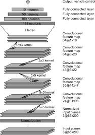
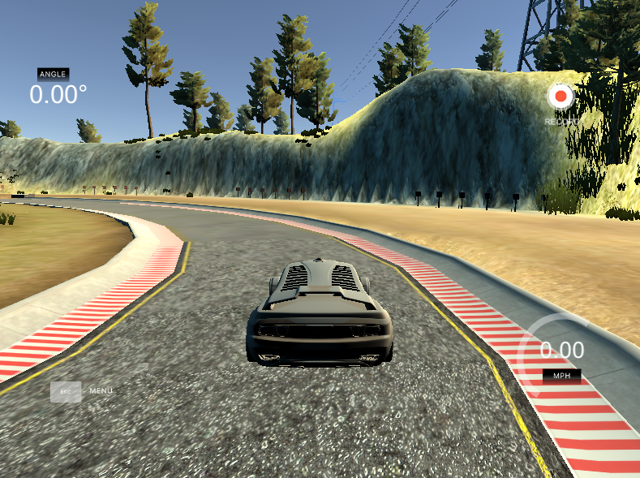
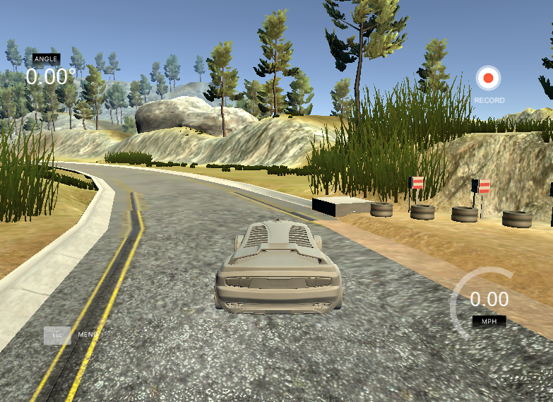
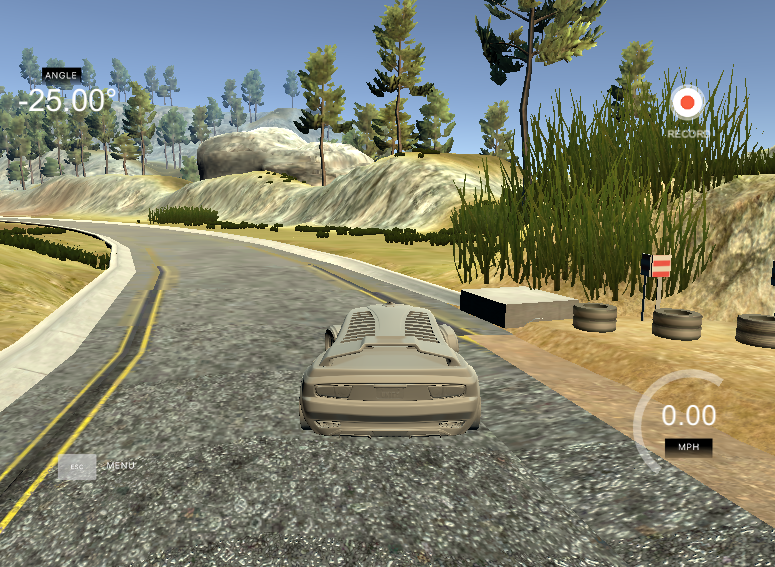
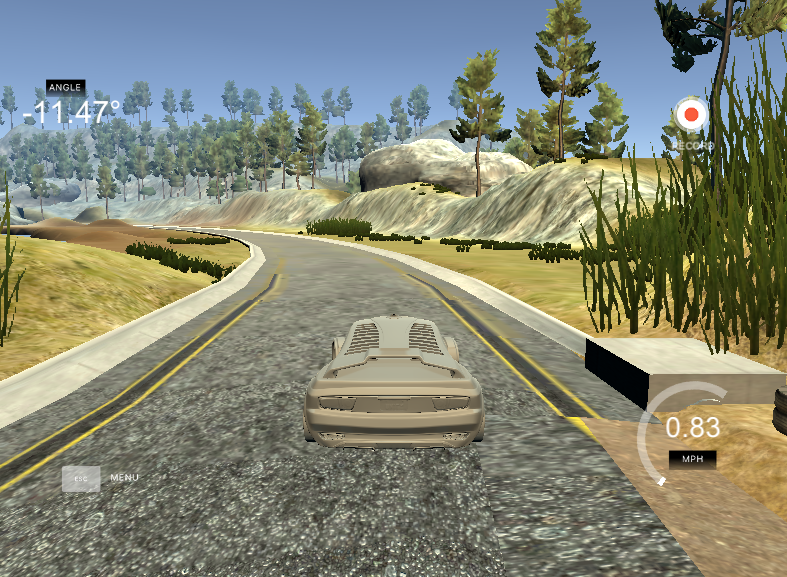
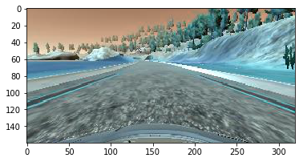
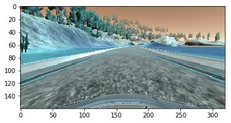
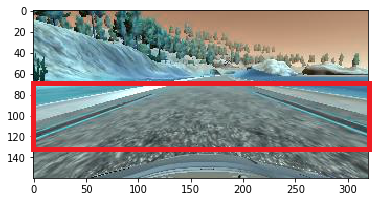

# **Behavioral Cloning** 

## Writeup Template

---

**Behavioral Cloning Project**

The goals / steps of this project are the following:
* Use the simulator to collect data of good driving behavior
* Build, a convolution neural network in Keras that predicts steering angles from images
* Train and validate the model with a training and validation set
* Test that the model successfully drives around track one without leaving the road
* Summarize the results with a written report


## Rubric Points
### Here I will consider the [rubric points](https://review.udacity.com/#!/rubrics/432/view) individually and describe how I addressed each point in my implementation.  

---
### Files Submitted & Code Quality

#### 1. Submission includes all required files and can be used to run the simulator in autonomous mode

My project includes the following files:
* model.py containing the script to create and train the model
* drive.py for driving the car in autonomous mode
* model.h5 containing a trained convolution neural network 
* writeup_report.md summarizing the results

#### 2. Submission includes functional code
Using the Udacity provided simulator and my drive.py file, the car can be driven autonomously around the track by executing 
```sh
python drive.py model.h5
```

#### 3. Submission code is usable and readable

The model.py file contains the code for training and saving the convolution neural network. The file shows the pipeline I used for training and validating the model, and it contains comments to explain how the code works.

### Model Architecture and Training Strategy

#### 1. An appropriate model architecture has been employed

My model is based on NDIVIA architecture. As a result, my model consists of five convolution layer with 5x5 and 3x3 filter size and depths between 24 and 64 (model.py lines 86-91).
The model includes RELU layers to introduce nonlinearity (code line 86-91), and the data is normalized in the model using a Keras lambda layer (code line 84).
Moreover, I cropped the image so that I considered only the road in my training images and I did not take into account the sky or other objects beside the road, such as trees and mountains.

#### 2. Attempts to reduce overfitting in the model

To reduce overfitting, I added a dropout layer after the Max Pooling layer, because I observed that the training loss was considerably smaller than the validating loss. which is a signal that my model was overfitting my data.

#### 3. Model parameter tuning

The model used an adam optimizer (line 100).

#### 4. Appropriate training data

Training data was chosen to keep the vehicle driving on the road. I used only center lane driving, because I thought using the left and rigth images would introduce another parameter to be tuned (a constant value to be added in the steering angle).

For details about how I created the training data, see the next section. 

### Model Architecture and Training Strategy

#### 1. Solution Design Approach

The overall strategy for deriving a model architecture was to collect data from two laps of center lane driving in the clockwise and two laps of center lane driving in the anti-clockwise.

In addtion, I collect data from one lap recovering from the sides in order to the model learn how to return to the road before getting out of it.

Moreover, I complete the data construction with a lap focusing on driving smoothly around curves.

Finally I had more than 7000 images to train and create my model. My first step was to use a convolution neural network model similar to the Le Net. I thought this model might be appropriate because it was used in the Traffic-Sign-Recognition project and deliveried outstanding results.

In order to gauge how well the model was working, I split my image and steering angle data into a training and validation set, and I observed that both the training loss and validation loss was similar, which meant that the overfitting was not a problem.

However, when I tested my model in the autonomous mode, the car get out the track specially on the stretch of earth and on the bridge. To improve it, I collected more data in these spots. 

I foccused on recovering the driving from sides, because I recognized that the model did not have enough data for the car deal with earth and  passing through the bridge.

In the end, I had almost double the amount of the original images. Indeed I had more than 13600 images. As a result, when I tested my model in the track one, my car drove considerably worse, but better in the bridge and in curves with earth. 

The problem of my model was not the images I have collected, but the proportion of the types of images. Indeed, I had approximately 7000 images spread in 6 laps and more than 6000 images only in the bridge and in curves with earth.

Therefore, I reduced the quantity of images only in the bridge and in the earth curves, so that the proportion become 7500 and 2500. 

As a result, my model drove better and achieved to pass the bridge and the earth curve. However, it fell off the track in some spots. 

To face this problem, I changed my model to one that is similar to NVIDIA architecture, which is much more powerfull than Le Net, because has much more neurons and layers. 

At the end of the process, the vehicle is able to drive autonomously around the track without leaving the road.

#### 2. Final Model Architecture

The final model architecture (model.py lines 74-85) consisted of a convolution neural network with the following layers and layer sizes :

Nº Layer|Description|Size Filter| Depth
--------|----------|----|---
1|Convolution2D|5x5|24
2|Convolution2D|5x5|36
3|Convolution2D|5x5|48
4|Convolution2D|3x3|64
5|Convolution2D|2x2|64
6|Convolution2D|2x2|64
7|MaxPooling|2x2|--
8|Dropout|0.50|--
9|Flatten|--|--
10|Relu|100|--
11|Relu|50|--
12|Relu|10|--
13|Relu|1|--

Here is a visualization of the architecture (note: visualizing the architecture is optional according to the project rubric)



#### 3. Creation of the Training Set & Training Process

To capture good driving behavior, I first recorded two laps on track one using center lane driving. Here is an example image of center lane driving:



I then recorded the vehicle recovering from the left side and right sides of the road back to center so that the vehicle would learn to avoid leaving off the road. These images show what a recovery looks like starting from left :

1. The car is going to leave the road:

2. The steer angle is completed to the left (-25°):

3. The steer angle is less to left (11,47°) because the car is almost in the center of the road:


Then I repeated this process on track two in order to get more data points.

To augment the data sat, I also flipped images and angles thinking that this would improve my model. For example, here is an image that has then been flipped:





After the collection process, I had 20000 number of data points. I then preprocessed this data by normalization based on the following formula:

```sh
pixel_normalized = pixel/255 -0.5
```
In Addition, I cropped the up 70 pixels to get rid of the sky and the botton 25 pixels to hide the car hood, in order to foccus the learn only on the road.




I finally randomly shuffled the data set and put 20% of the data into a validation set. 

I used this training data for training the model. The test set helped determine if the model was over or under fitting. The ideal number of epochs was 5 as evidenced by the not decreasing mean square error in each epoch. I used an adam optimizer so that manually training the learning rate wasn't necessary.
